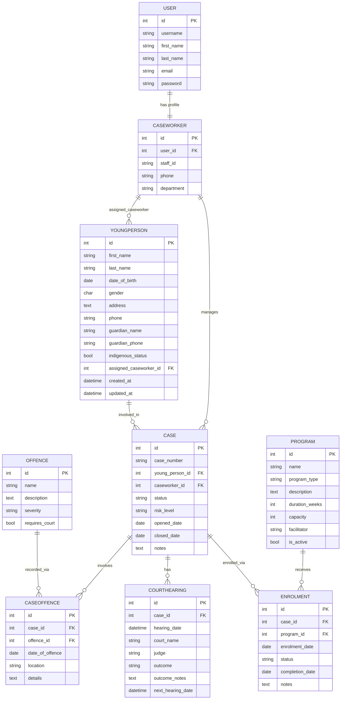

# Entity Relationship Diagram

**Project:** Youth Justice Case Management System

**Author:** Samirrimal

**Date:** 2026-04-19

---

## ERD — Mermaid Diagram

---

## Relationship Summary

| Relationship | Cardinality | Through Model | On Delete | Notes |
|---|---|---|---|---|
| `User` → `Caseworker` | One-to-One | — | CASCADE | Django profile pattern (ADR-003) |
| `Caseworker` → `YoungPerson` | One-to-Many | — | SET_NULL | Deleting caseworker preserves clients |
| `Caseworker` → `Case` | One-to-Many | — | SET_NULL | Deleting caseworker preserves cases |
| `YoungPerson` → `Case` | One-to-Many | — | CASCADE | Deleting client removes their cases |
| `Case` ↔ `Offence` | Many-to-Many | `CaseOffence` | CASCADE | Stores date_of_offence, location (ADR-001) |
| `Case` → `CourtHearing` | One-to-Many | — | CASCADE | Multiple hearings per case (adjournments) |
| `Case` ↔ `Program` | Many-to-Many | `Enrolment` | CASCADE | Stores status, enrolment_date (ADR-001) |

---

## Design Notes

### Through Models (ADR-001)
Both many-to-many relationships use explicit through models instead of plain `ManyToManyField`. This is because:
- `CaseOffence` stores `date_of_offence` and `location` — attributes of the specific occurrence, not of either `Case` or `Offence` alone
- `Enrolment` stores `status`, `enrolment_date`, and `completion_date` — attributes of the specific enrolment, not of either `Case` or `Program` alone

### Cascade Choices
- `SET_NULL` on `Caseworker` foreign keys — a caseworker leaving the organisation should not delete client and case records. Records become unassigned and can be reassigned.
- `CASCADE` on `YoungPerson → Case` — a case without a client has no meaning and should not persist.
- `CASCADE` on `Case → CourtHearing / CaseOffence / Enrolment` — these records are owned by the case.

### Fat Model Pattern (ADR-005)
Business logic methods live on models, not views or templates:
- `YoungPerson.age()` — calculates current age from `date_of_birth`
- `YoungPerson.active_case_count()` — counts open cases
- `Program.available_spots()` — computes remaining capacity from active enrolments
- `Program.is_full()` — boolean helper derived from `available_spots()`
- `Case.is_open()` — boolean helper for status check
- `Case.hearing_count()` — count of hearings for display
