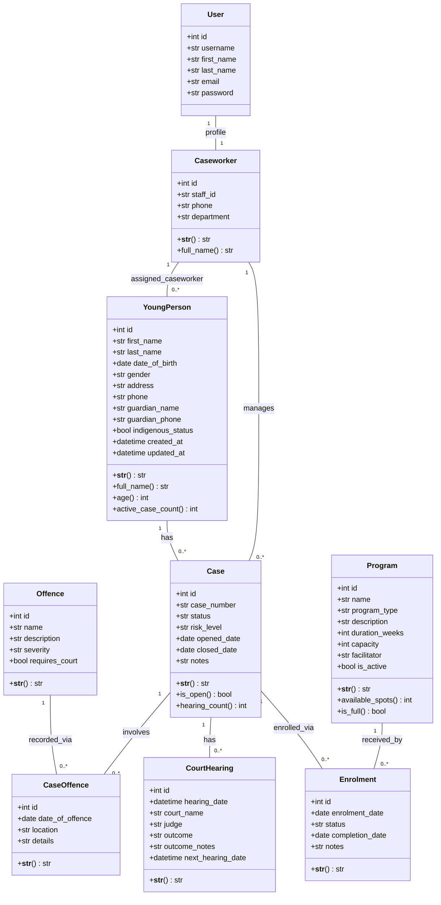

# Class Diagram

**Project:** Youth Justice Case Management System  
**Diagram Type:** UML Class Diagram (text representation)

---

## Class Diagram — Mermaid

---

## Design Patterns Applied

### 1. Fat Model Pattern (ADR-005)
Business logic methods live on the model, not in views or templates:

| Model | Method | Purpose |
|-------|--------|---------|
| `YoungPerson` | `age()` | Calculates age from `date_of_birth` using `timezone.now()` |
| `YoungPerson` | `active_case_count()` | Returns count of open cases — avoids template logic |
| `YoungPerson` | `full_name()` | Concatenates first and last name — reusable helper |
| `Program` | `available_spots()` | `capacity - active enrolments` — uses `filter()` not iteration |
| `Program` | `is_full()` | Delegates to `available_spots() == 0` — single source of truth |
| `Case` | `is_open()` | `status == 'open'` — readable boolean helper |
| `Case` | `hearing_count()` | `hearings.count()` — single query via reverse FK |

### 2. Profile Pattern — OneToOne (ADR-003)
`Caseworker` extends `User` via `OneToOneField`. This separates:
- Authentication concerns → `User` (Django managed)
- Domain concerns → `Caseworker` (project managed)

### 3. Through Model Pattern (ADR-001)
Both M2M relationships use explicit through models:
- `Case.offences` → through `CaseOffence` (stores `date_of_offence`, `location`)
- `Case.programs` → through `Enrolment` (stores `status`, `enrolment_date`, `completion_date`)

### 4. MTV — Model Layer Separation
Models encapsulate data and business logic. They do not import from:
- `views.py` — no view dependencies
- `templates/` — no template rendering
- `urls.py` — no URL resolution

This enforces Django's loose-coupling philosophy at the class level.

---

## Object-Oriented Principles

| Principle | Application |
|-----------|-------------|
| **Encapsulation** | Each model class encapsulates its own data and related behaviour (methods). `Program.available_spots()` hides the enrolment count calculation from callers. |
| **Single Responsibility** | Each model has one cohesive responsibility. `YoungPerson` represents a client's personal data. `Case` represents the legal/administrative case. `Enrolment` represents the program relationship. |
| **DRY / Inheritance** | All templates extend `base.html`. All CBVs inherit from Django's generic views. Business logic defined once on models, used everywhere. |
| **Composition** | A `Case` is composed of a `YoungPerson`, a `Caseworker`, multiple `CourtHearings`, and multiple `Enrolments`. Relationships model real-world composition. |
| **Abstraction** | Domain methods such as `Case.is_open()` and `Program.is_full()` expose intent-focused APIs so callers do not need to know query details. |
| **Polymorphism** | Shared Django model/view interfaces allow consistent usage across entities (for example, model instances rendered via common template and generic-view patterns). |
